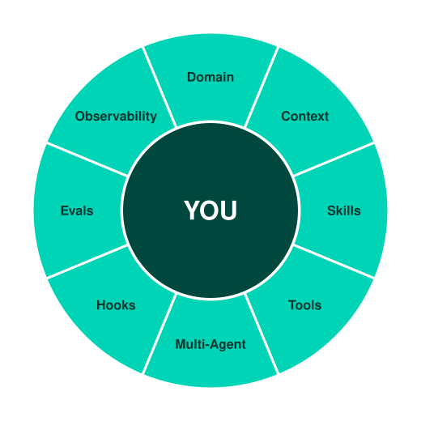

# build-harness

An interactive domain-agnostic skill that walks you through designing your own multi-agent harness (context, roles, tools, pipeline, guards, evals, and observability), tailored to your own field through guided questions instead of a fixed template.

Claude asks you about your domain, then co-builds the actual harness artifacts with you, one module at a time, the way you'd run a real workshop rather than hand someone a reference doc to read on their own.

<p align="center">
  
</p>

## Why

Most "how to build an agent system" guides teach you the concepts in the abstract, or show you one hardcoded example (usually code generation) that doesn't map cleanly onto your own field. This skill flips that: it asks about *your* domain first, including what you produce, what your source of truth is, what roles already exist in your workflow, and what must never go wrong. Only then does it build the harness, using your own vocabulary throughout.

The 8-module structure works for any field: design systems, legal review, financial reporting, content ops, customer support, research pipelines, engineering, anywhere a repeatable, multi-step piece of work currently depends on a person doing it carefully every time.

## Install

As a Claude Code plugin (recommended):

```
/plugin marketplace add Jeromski62/build-harness
/plugin install build-harness@build-harness
```

Or copy the skill into your project's skills folder directly:

```
your-project/.claude/skills/build-harness/   ← copy contents of skills/build-harness/ here
```

Either way, no dependencies, no build step. It's plain markdown that Claude Code reads directly.

## Use

In a Claude Code session, either:
- Say what you want in plain language, e.g. *"I want to build an agent harness for reviewing customer support tickets,"* and Claude will recognize the skill and start the workshop, or
- Invoke it explicitly if your setup supports slash commands: `/build-harness`

The workshop runs across as many sessions as it takes. Progress is tracked in a `CURRICULUM.md` file that Claude reads first each time, so you can pick up exactly where you left off.

## What it produces

```
CURRICULUM.md          ← progress tracker, read first in every session
HANDOUT.md              ← open items, grows with each module
harness/
  AGENTS.md             ← Module 1: persistent context & hard rules
  README.md             ← how the pieces connect
  skills/               ← Module 2: one file per specialized role
  tools/                ← Module 3: tool/MCP configuration
  agents/               ← Module 4: pipeline & handoffs
  hooks/                ← Module 5: deterministic guards
  evals/                ← Module 6: pass/fail test set
  observability/        ← Module 7: session logs & metrics
```

## The 8 modules

| # | Module | Question it answers |
|---|---|---|
| 0 | Intake | What field is this for, and what does the harness need to know? |
| 1 | Context Engineering | What must the agent know on day one? |
| 2 | Rule Files & Skills | Who does what, and where does each role's job end? |
| 3 | Tools & MCP | What does each role need to be able to touch? |
| 4 | Multi-Agent Design | What order do things happen in, and how do roles hand off to each other? |
| 5 | Hooks & Guards | What must never happen, and how do you enforce that deterministically? |
| 6 | Evals | How do you know the harness is actually working? |
| 7 | Observability | What's happening right now, and what does it cost? |
| 8 | Dashboard (bonus) | Optional, unlocked after 5+ real logged sessions |

## Structure

```
.claude-plugin/
  plugin.json                     ← plugin manifest
  marketplace.json                ← lets /plugin marketplace add find this repo
skills/build-harness/
  SKILL.md                        ← facilitation logic Claude follows
  reference/
    00-intake.md                  ← domain intake questions
    01-context-engineering.md     ← Modules 1-7: lesson + exercise + notes
    02-rule-files-skills.md
    03-tools-mcp.md
    04-multi-agent-design.md
    05-hooks-guards.md
    06-evals.md
    07-observability.md
    08-dashboard-bonus.md
  templates/
    CURRICULUM.template.md        ← progress-tracker skeleton
```

Each `reference/` file has four parts: **Core Idea** (the lesson, in plain language), **Questions For You** (what gets asked in chat), **What Gets Built** (the resulting artifact), and **Notes For Running This** (facilitation guidance for Claude, not shown to the user).

## Origin

Generalized from a hands-on course originally built to teach one specific team how to construct a design-system harness. The 7-module structure (context, skills, tools, multi-agent, hooks, evals, observability) turned out to be domain-independent; only the content needed to change per field. This repo is that structure, parameterized on whoever runs it.

## License

MIT. See [LICENSE](LICENSE).
